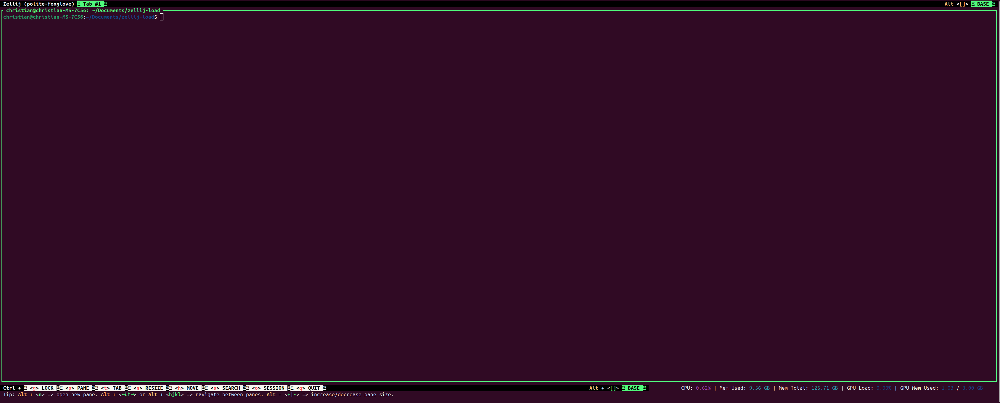
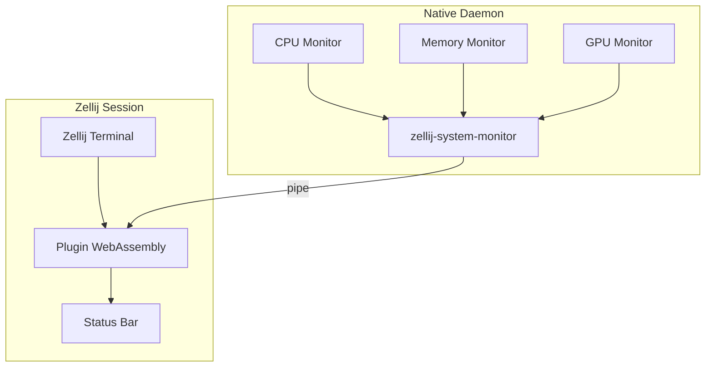
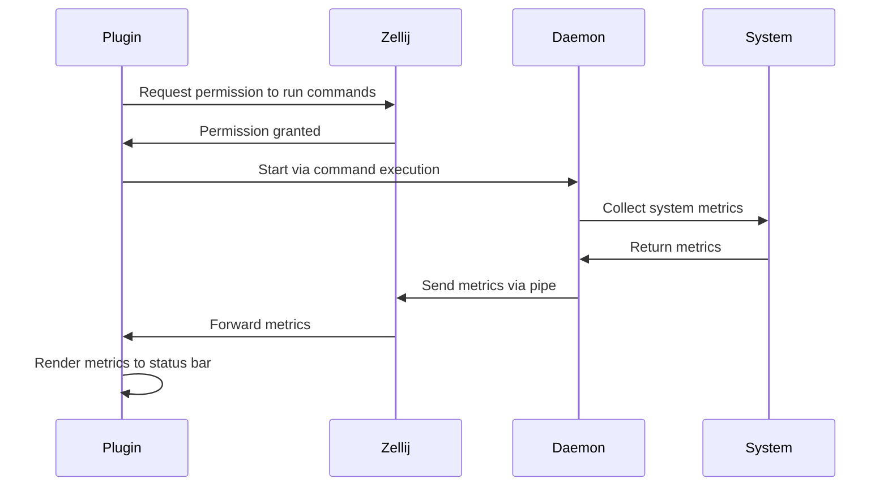

# Zellij Load

A system monitoring plugin for Zellij terminal multiplexer that displays real-time CPU, memory, and GPU usage.



## Overview

Zellij Load is a two-component system monitoring solution for Zellij:
- A native daemon that collects system information
- A WebAssembly plugin that renders the data in the Zellij status bar

The system is designed to be efficient, with minimal resource usage, and provides a clean, colored display of system metrics.

## Building

This project uses [Just](https://github.com/casey/just) for task automation. The `justfile` provides several build targets:

```justfile
# Build all components (daemon and WASM plugin)
just build-all

# Build only the native daemon
just build-daemon

# Build only the WASM plugin
just build-wasm

# Install the daemon to system path
just install

# Uninstall the daemon from system path
just uninstall
```

### Prerequisites

- Rust toolchain (latest stable)
- Just (task runner)
- Zellij terminal multiplexer
- For GPU monitoring: GPU drivers with support for querying GPU statistics

## Installation and Setup

1. Build the project:
   ```bash
   just build-all
   ```

2. Install the daemon:
   ```bash
   just install
   ```

3. Add the plugin to your Zellij configuration:
   ```kdl
   layout {
       pane size=1 borderless=true {
           plugin location="tab-bar"
       }
       pane
       pane size=2 split_direction="vertical" {
           pane size="65%" borderless=true {
               plugin location="status-bar"
           }
           pane size="35%" borderless=true {
               plugin location="file:/path/to/zellij-load/target/wasm32-wasip1/release/zellij-load-plugin.wasm"
           }
      }
   }
   ```

   Replace `/path/to/zellij-load` with the actual path to the repository.
 
**Note: You do NOT need to use this excact layout BUT you do need to follow the vertical split pane for the bottom or top pane so the plugin doesnt need its own line**

## Development

### Running During Development

For development, you can use the provided just commands:

```bash
# Run the daemon in debug mode
just run-daemon

# Run the plugin in debug mode
just run-debug

# Build and run the plugin
just run
```

### Project Structure

```
zellij-load/
├── src/
│   ├── bin/
│   │   ├── plugin.rs              # WASM plugin entry point
│   │   └── zellij-system-monitor.rs # Native daemon entry point
│   ├── system_info/
│   │   ├── cpu.rs                 # CPU usage collection
│   │   ├── gpu.rs                 # GPU usage collection
│   │   ├── mem.rs                 # Memory usage collection
│   │   └── info.rs                # Data structures
│   └── lib.rs                     # Library entry point
├── Cargo.toml                     # Rust project configuration
├── default.kdl                    # Example Zellij layout
└── justfile                       # Build tasks
```

### Architecture

The system consists of two main components that communicate via Zellij's pipe mechanism:

#### Daemon (Native Component)

The native daemon (`zellij-system-monitor`) is responsible for:
- Collecting system metrics (CPU, memory, GPU)
- Processing and formatting the data
- Sending updates to the plugin through Zellij pipes

#### Plugin (WebAssembly Component)

The plugin (`zellij-load-plugin.wasm`) is responsible for:
- Receiving system data from the daemon
- Rendering the information in the Zellij status bar
- Managing permissions and lifecycle



### Data Flow

1. The daemon periodically collects system metrics
2. The daemon serializes the data as JSON and sends it through a Zellij pipe
3. The plugin receives the data, deserializes it, and renders the information
4. The plugin displays CPU usage, memory usage, and GPU information (if available)



## Contributing

Contributions Welcomed! Please follow these guidelines:

1. Fork the repository
2. Create a feature branch (`git checkout -b feature/amazing-feature`)
3. Make your changes
4. Ensure tests pass and code is properly formatted
5. Commit your changes using [conventional commit messages](https://www.conventionalcommits.org/en/v1.0.0/)
6. Push to the branch (`git push origin feature/amazing-feature`)
7. Open a Pull Request

### Code Style

- Follow Rust conventions and idioms
- Use `rustfmt` to format code
- Use `cargo clippy` to check for common issues
- Document public APIs with Rustdoc comments

### Testing

Before submitting a PR, please ensure:
- All existing tests pass
- New functionality includes appropriate tests
- The daemon starts and can collect system metrics
- The plugin correctly renders the metrics

## Troubleshooting

### Common Issues

1. **Permission Denied**: Ensure the plugin has permissions to run commands and open files
2. **GPU Not Detected**: Verify GPU drivers are properly installed and support querying statistics (Currently only tested with NVIDIA GPUs)
3. **Plugin Not Loading**: Check the path in your Zellij configuration is correct

### Debugging

- Enable debug output in the plugin by checking the output of `zellij setup --dump-config`
- Check `/tmp/zellij-<UID>/system-monitor-lock` to verify the daemon is running
- Monitor system logs for any daemon error messages

## License

This project is licensed under the MIT License - see the LICENSE file for details.
